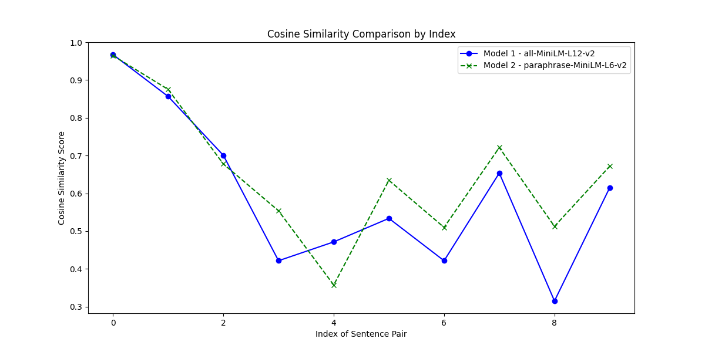

### Voraussetzungen
Eine eigene Textdatei (`.txt`) wird benötigt, um die Satzpaare für den Vergleich bereitzustellen. In dieser Datei sollten die Satzpaare zeilenweise durch ein `|` getrennt sein, z. B.:
Satz1_A | Satz2_A Satz1_B | Satz2_B

### 1. Laden der Modelle
Zwei verschiedene **Sentence-BERT-Modelle** werden geladen, um die Sätze unterschiedlich zu interpretieren und zu vergleichen.

### 2. Lesen der Sätze
Die Satzpaare werden aus der Textdatei eingelesen, wobei jedes Paar durch eine `|`-Trennlinie im Text getrennt ist.

### 3. Berechnung der Ähnlichkeit
- Für jedes Satzpaar werden **Einbettungen** (Embeddings) erstellt.
- Die **Kosinus-Ähnlichkeit** zwischen den beiden Satz-Einbettungen wird für jedes Modell berechnet und gespeichert.

### 4. Visualisierung der Ergebnisse
- **Histogramme** zeigen die Verteilung der Ähnlichkeitswerte für beide Modelle an.
- Ein **Liniendiagramm** visualisiert die Ähnlichkeitswerte für jedes Modell über alle Satzpaare hinweg und erleichtert so den direkten Vergleich.

